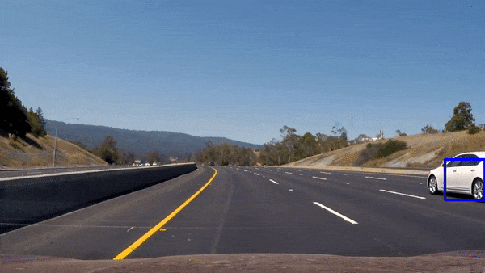

# Introduction

A trained Linear SVM to detect and track vehicles on road. SVM was trained these [vehicles](https://s3.amazonaws.com/udacity-sdc/Vehicle_Tracking/vehicles.zip) and [non vehicles](https://s3.amazonaws.com/udacity-sdc/Vehicle_Tracking/non-vehicles.zip) datasets. These example images come from a combination of the [GTI vehicle image database](http://www.gti.ssr.upm.es/data/Vehicle_database.html), and [the KITTI vision benchmark suite](http://www.cvlibs.net/datasets/kitti/)

# Pipeline

- Extract spatial, color histogram and HOG features
- Do train and test data split
- Train SVM using **Sklearn** library
- Use multi-scale optimized sliding windows to detect vehicles
- Apply HeatMap to fitler False positives
- Detect and Track vehicles in video frames. 

# Getting Started

- Please setup your Python environment first with [this start kit](https://github.com/udacity/CarND-Term1-Starter-Kit).

- Be sure to activate environment using command `source activate carnd-term1`.
- All code is written in Jupyter Notebook and each step is detailed and code is commented so running the Jupyter Notebook sequentially should work fine. Just make sure paths to training data are fine.

# License 

This code is licensed under [MIT License](https://opensource.org/licenses/MIT)
